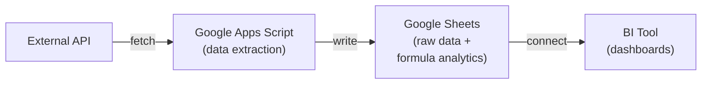
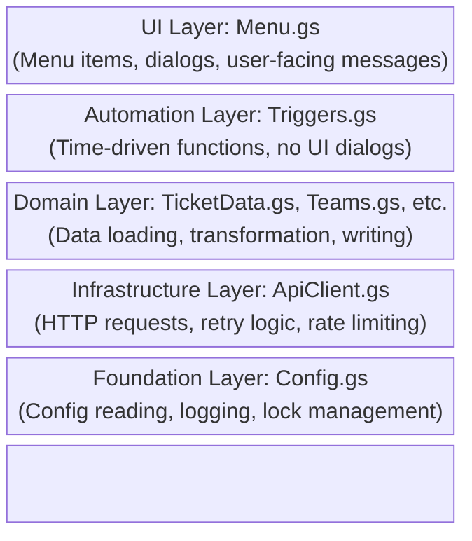
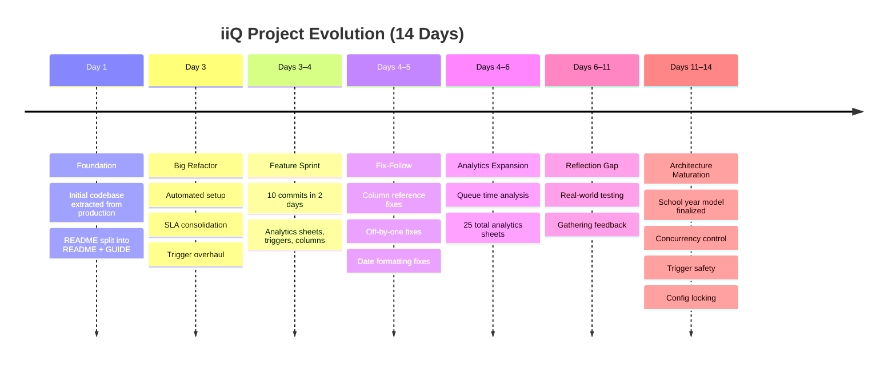

# Building API-to-Sheets Analytics Projects

> [!abstract] Purpose
> This document captures hard-won knowledge from building a Google Apps Script system that extracts API data into Google Sheets with formula-based analytics. It's intended as a guideline for building similar projects covering different data domains.

## Table of Contents

1. [[#Project Anatomy]]
2. [[#Build Order — What to Build First]]
3. [[#Lessons Learned — What Worked]]
4. [[#Lessons Learned — What Didn't Work]]
5. [[#Architecture Patterns to Reuse]]
6. [[#The File Structure Template]]
7. [[#Configuration Management]]
8. [[#API Client Pattern]]
9. [[#Data Loading with Timeout Resume]]
10. [[#Concurrency and Safety]]
11. [[#Trigger Strategy]]
12. [[#Analytics Sheet Patterns]]
13. [[#Menu System Design]]
14. [[#Logging and Observability]]
15. [[#Documentation Strategy]]
16. [[#Common Pitfalls and Gotchas]]
17. [[#Checklist — New Project Kickoff]]

---

## Project Anatomy

Every project following this pattern has the same fundamental architecture:



> [!tip] Key Insight
> Google Sheets serves as both a **data warehouse** and a **computation engine**. Raw data lands in a primary data sheet, and analytics sheets calculate everything via formulas — no scripts needed for analytics.

This means:
- Analytics update automatically when data refreshes
- Users can inspect and modify formulas without touching code
- BI tools (Power BI, Looker Studio) connect directly to the sheets
- The script layer is purely responsible for data extraction

> [!info] Scope per Spreadsheet
> One logical data boundary per spreadsheet (e.g., one school year, one fiscal quarter, one department). This keeps data volumes manageable within Google Sheets limits and simplifies the loading/refresh logic.

---

## Build Order — What to Build First

The iiQ project evolved through 23+ commits over two weeks. Here's the optimal build order distilled from that experience.

### Phase 1: Foundation (Build First)

| Priority | Component | Why First |
| :------: | --------- | --------- |
| 1 | `Config.gs` | Everything depends on configuration. Build the config reader, type coercion helpers, and logging utility first. |
| 2 | `ApiClient.gs` | HTTP client with retry/backoff. You'll use this immediately and continuously. |
| 3 | Primary data loader | The main data sheet (e.g., `TicketData.gs`). Get one entity type flowing end-to-end before anything else. |
| 4 | `Setup.gs` (basic) | Automate sheet creation from day one. Manual sheet setup doesn't scale and leads to inconsistency. |
| 5 | `Menu.gs` (basic) | A minimal menu to run operations. Even "Load Data" and "Show Status" is enough. |

> [!warning] Lesson Learned
> The original project started without automated setup — users had to manually create sheets and copy formulas from documentation. This was replaced by programmatic setup in the first major refactor. **Automate sheet creation from the start.**

### Phase 2: Reliability (Build Second)

| Priority | Component | Why Second |
| :------: | --------- | ---------- |
| 6 | Timeout handling + resume | The 6-minute Apps Script limit will bite you immediately with any real data volume. |
| 7 | Progress tracking | Config-based pagination state so loading can resume across invocations. |
| 8 | `Triggers.gs` (basic) | At minimum: a continuation trigger that resumes interrupted loads. |
| 9 | Concurrency control | LockService wrappers to prevent overlapping operations. |

> [!warning] Lesson Learned
> The concurrency control came much later (commit 25 of 27) but caused real data corruption issues before it was added. **Build it early.**

### Phase 3: Analytics (Build Third)

| Priority | Component | Why Third |
| :------: | --------- | --------- |
| 10 | Default analytics sheets | 5–7 high-value formula sheets that answer the most common questions. |
| 11 | Optional analytics framework | The `OptionalMetrics.gs` pattern for on-demand sheet creation. |
| 12 | Specific optional sheets | Build these incrementally based on user requests. |

> [!tip] Scaling Pattern
> The iiQ project went from 0 to 7 default + 18 optional analytics sheets. Start with defaults that answer the top questions, then add optional sheets iteratively. The modular pattern (`addXxxSheet()` wrapper calling `setupXxxSheet(ss)`) scales well.

### Phase 4: Polish (Build Last)

| Priority | Component | Why Last |
| :------: | --------- | -------- |
| 13 | Advanced trigger strategy | Multi-trigger schedule for data freshness. |
| 14 | Historical data handling | Special logic for static/archived data periods. |
| 15 | Trigger safety / destructive op guards | `requireNoTriggers()` pattern for dangerous operations. |
| 16 | BI tool documentation | Dashboard templates for Looker Studio / Power BI. |

---

## Lessons Learned — What Worked

### Consolidated Data Loading

> [!example]- Before & After
> **Before:** Two separate loaders writing to two sheets (`TicketData.gs` + `TicketSlaData.gs`). Users had to load each independently, and the data could get out of sync.
>
> **After:** SLA data fetched per-batch during ticket loading and written as additional columns in the same row. One load operation, always in sync.

**Guideline:** If you have related data from different API endpoints, fetch it per-batch and merge into a single row. Don't create separate sheets that need to be joined later.

### Formula-Based Analytics (No Scripts for Computation)

Every analytics sheet uses Google Sheets formulas (`LET`, `LAMBDA`, `FILTER`, `BYROW`, `COUNTIFS`, `HSTACK`, `SORT`). No script code runs to compute analytics.

**Why this works:**
- Analytics update automatically when data changes
- Users can see and modify the formulas
- No additional script execution time consumed
- BI tools can connect to pre-computed results

**Guideline:** Use the data loader scripts only for data extraction. Let Google Sheets formulas handle all computation and aggregation.

### Progressive Documentation Strategy

Four documents serving different audiences:

| Document | Audience | Purpose |
| -------- | -------- | ------- |
| `README.md` | Admins, stakeholders | Quick start, what you get, troubleshooting |
| `GUIDE.md` | Power users, IT staff | Detailed formulas, setup walkthrough, customization |
| `CLAUDE.md` | AI assistants, developers | Architecture, code patterns, column references |
| Dashboard docs | BI analysts | Step-by-step dashboard build instructions |

**Guideline:** Don't try to serve all audiences in one document. Layer the documentation with progressive disclosure.

### CLAUDE.md as Project Memory

The `CLAUDE.md` file evolved from 103 lines to a comprehensive technical reference. Combined with `.claude/memory/MEMORY.md`, it gives AI assistants full context to make correct changes.

Key sections that proved essential:
- Column layout table with exact column letters
- "Name column vs ID column" pattern for formulas
- Config key reference (required vs optional vs auto-managed)
- Code structure table with file purposes and dependencies
- Key code patterns with snippets

**Guideline:** Treat `CLAUDE.md` as critical infrastructure. Update it with every significant change. Include column mappings, formula patterns, and gotchas.

### Config Sheet as the Control Plane

All configuration, progress tracking, and operational state lives in the Config sheet as key-value pairs.

- Users can inspect and modify settings without touching code
- Progress is visible (users can see `TICKET_LAST_PAGE = 45`)
- Debugging is easier (check Config values to understand state)
- No hidden state in script properties or cache

**Guideline:** Use a Config sheet for everything. Make operational state visible to users.

### The `deleteSheetIfExists` Pattern

Every analytics sheet creation starts by deleting the existing sheet (if any) and recreating from scratch. This guarantees:
- Clean slate (no stale data or broken formulas)
- Idempotent operations (run setup twice, get the same result)
- Easy updates (change the formula, rerun setup)

```javascript
function setupXxxSheet(ss) {
  deleteSheetIfExists(ss, 'SheetName');
  const sheet = ss.insertSheet('SheetName');
  // ... build from scratch
}
```

### Exponential Backoff from Day One

The API client had retry logic with exponential backoff from the very first commit. This was never reworked or debugged because it was already production-tested.

**Guideline:** Don't skip retry logic in v1. API rate limits and transient failures are inevitable. Build the backoff pattern into your API client from the start.

---

## Lessons Learned — What Didn't Work

### Multi-Year Data in One Spreadsheet (Abandoned)

> [!failure] What Happened
> A single spreadsheet held data for multiple years, with config keys like `TICKET_2024_LAST_PAGE`, `TICKET_2025_LAST_PAGE`, etc. A `discoverYearsFromConfig()` function auto-discovered which years had data.

**Why it failed:**
- Config sheet became cluttered with year-prefixed keys
- Progress tracking was complex (per-year pagination state)
- Sheet size grew unbounded
- Trigger logic had to iterate over all years

**Replacement:** One spreadsheet = one school year. The `SCHOOL_YEAR` config key defines the scope. Simple, clean, bounded.

**Guideline:** One logical data boundary per spreadsheet. Don't try to cram multiple time periods into one file.

### Separate SLA Data Sheet (Abandoned)

> [!failure] What Happened
> Tickets in one sheet, SLA metrics in another. Required users to load each separately.

**Why it failed:**
- Two loading operations to manage instead of one
- Data could get out of sync (tickets loaded but SLA not)
- Joining data across sheets in formulas is awkward
- Double the trigger complexity

**Replacement:** SLA data fetched per-batch and merged into ticket rows as additional columns.

**Guideline:** Merge related data into a single row in a single sheet whenever possible. The small cost of wider rows is far outweighed by the simplicity.

### Manual Sheet Setup (Abandoned)

> [!failure] What Happened
> Users created sheets manually and copied formulas from documentation.

**Why it failed:**
- Error-prone (wrong column references, missing formulas)
- Time-consuming (25 sheets to create)
- Hard to update (change a formula? Tell every user to update their sheet)
- Documentation went stale as formulas evolved

**Replacement:** `Setup.gs` programmatically creates all sheets with headers, formulas, formatting, and data validation.

**Guideline:** Automate sheet creation from day one. Never ask users to copy formulas from documentation.

### Simple Boolean Reload Flag (Replaced)

> [!failure] What Happened
> A `RELOAD_IN_PROGRESS` boolean flag in Config to prevent triggers from running during reloads.

**Why it failed:**
- If the script crashed, the flag stayed `true` permanently (orphaned lock)
- No timeout mechanism
- Didn't prevent concurrent menu operations

**Replacement:** Google Apps Script's `LockService` with auto-expiring locks (6-minute timeout matches the execution limit).

**Guideline:** Never use manual boolean flags for concurrency control. Use `LockService` — it handles timeouts and crash recovery automatically.

### Hardcoded Column Counts (Ongoing Pain Point)

Column count (e.g., `getRange(..., 39)`) is hardcoded in multiple files. Every time a column is added:
- 7+ locations in `TicketData.gs` need updating
- 3+ locations in `Triggers.gs` need updating
- Header arrays in `Setup.gs` and `Triggers.gs` need updating
- Formula column references across all analytics sheets shift

> [!tip] Better Approach
> Define column count from the header array length (`headers.length`) everywhere, not hardcoded numbers. See [[#Appendix C — The Column Count Problem]] for a full solution.

### 1-Indexed Page Tracking (Fixed)

**Original:** Pages tracked as 1-indexed (page 1, 2, 3...). Caused off-by-one errors in completion detection.

**Fix:** Switched to 0-indexed page tracking. For display purposes, add 1 when showing to users.

**Guideline:** Use 0-indexed page tracking internally. It aligns with API pagination and eliminates off-by-one errors.

### Numeric Config Values in Google Sheets (Fixed)

**Problem:** Storing numeric values like `0` or `5` in Google Sheets cells. Sheets sometimes auto-formatted these as dates (interpreting `5` as January 5, 1900).

**Fix:** Store all progress-tracking values as strings (`'5'` not `5`). Parse back to integers when reading.

> [!warning] Google Sheets Gotcha
> Always store Config values as strings. Google Sheets' auto-formatting is aggressive and unpredictable with bare numbers.

---

## Architecture Patterns to Reuse

### The Layered Architecture



> [!important] Key Rule
> Each layer only depends on layers below it. Menu.gs calls domain functions. Domain functions call ApiClient. ApiClient calls Config. **Never the reverse.**

### Menu vs Trigger Function Pairs

Every operation has two entry points:

```javascript
// Menu entry (UI): Shows dialogs, waits for lock
function refreshData() {
  const lock = acquireScriptLock();
  if (!lock) { showOperationBusyMessage('Refresh Data'); return; }
  try {
    const result = loadData(/* showUI = */ true);
    SpreadsheetApp.getUi().alert('Done: ' + result);
  } finally { releaseScriptLock(lock); }
}

// Trigger entry (headless): Logs, skips if busy
function triggerRefreshData() {
  const lock = tryAcquireScriptLock();
  if (!lock) { logOperation('Trigger', 'SKIP', 'busy'); return; }
  try {
    loadData(/* showUI = */ false);
  } finally { releaseScriptLock(lock); }
}
```

The shared `loadData()` function contains all the logic. The wrappers handle UI vs headless differences.

### Fail-Safe Data Merging

When fetching supplementary data (SLA, device info, etc.), failures should not block the primary data:

```javascript
let supplementaryMap = {};
try {
  supplementaryMap = fetchSupplementaryData(ids);
} catch (error) {
  logOperation('Supplementary', 'ERROR', error.message);
  // Continue with empty map -- primary data still writes
}
const rows = items.map(item => extractRow(item, supplementaryMap));
```

### Batch Write Pattern

> [!danger] Never write row-by-row. Always batch.

```javascript
// WRONG: O(n) sheet operations
items.forEach(item => {
  sheet.appendRow(extractRow(item));
});

// CORRECT: O(1) sheet operation
const rows = items.map(item => extractRow(item));
sheet.getRange(lastRow + 1, 1, rows.length, COLUMN_COUNT).setValues(rows);
```

---

## The File Structure Template

For a new project extracting `[EntityName]` data:

```
scripts/
  Config.gs            # Config reading, logging, locks, date helpers
  ApiClient.gs         # HTTP client with retry/backoff
  [EntityName]Data.gs  # Primary data loader (pagination, timeout, resume)
  [Secondary]Data.gs   # Optional: secondary entity loaders
  Setup.gs             # Sheet creation, headers, formulas (default analytics)
  Menu.gs              # Menu structure, UI entry points
  Triggers.gs          # Time-driven functions, trigger management
  OptionalMetrics.gs   # On-demand analytics sheets
  DailySnapshot.gs     # Optional: daily metric capture for trending

docs/
  README.md            # Quick start, what you get
  GUIDE.md             # Detailed implementation guide
  CLAUDE.md            # AI assistant context
  [BI tool] docs/      # Dashboard build instructions
```

**Naming conventions:**

| Pattern | Convention | Example |
| ------- | ---------- | ------- |
| Setup functions | `setupXxxSheet(ss)` | `setupMonthlyVolumeSheet(ss)` |
| Menu wrappers | `addXxxSheet()` | `addMonthlyVolumeSheet()` |
| Trigger functions | `triggerXxx()` | `triggerDataContinue()` |
| Menu functions | descriptive name | `refreshTicketDataContinue()` |

---

## Configuration Management

### Config Sheet Layout

| Key | Value | Type |
| --- | ----- | ---- |
| `API_BASE_URL` | `https://api.example.com` | Required |
| `BEARER_TOKEN` | `eyJhbGc...` | Required |
| `DATA_SCOPE` | `2025-2026` | Required |
| `PAGE_SIZE` | `100` | Optional |
| `THROTTLE_MS` | `1000` | Optional |
| `LAST_PAGE` | `45` | Auto-managed |
| `TOTAL_PAGES` | `234` | Auto-managed |
| `LOAD_COMPLETE` | `TRUE` | Auto-managed |
| `LAST_FETCH` | `2025-02-06T10:30:45.123Z` | Auto-managed |

### Config Reader Pattern

```javascript
function getConfig() {
  const sheet = SpreadsheetApp.getActiveSpreadsheet().getSheetByName('Config');
  const data = sheet.getDataRange().getValues();
  const config = {};
  data.forEach(row => { config[row[0]] = row[1]; });

  return {
    apiBaseUrl: getStringValue(config['API_BASE_URL']),
    bearerToken: getStringValue(config['BEARER_TOKEN']),
    dataScope: getStringValue(config['DATA_SCOPE']),
    pageSize: getIntValue(config['PAGE_SIZE'], 100),
    throttleMs: getIntValue(config['THROTTLE_MS'], 1000),
    lastPage: getIntValue(config['LAST_PAGE'], -1),
    totalPages: getIntValue(config['TOTAL_PAGES'], -1),
    loadComplete: getBoolValue(config['LOAD_COMPLETE']),
    lastFetch: getStringValue(config['LAST_FETCH']),
  };
}
```

### Type Coercion Helpers (Essential)

> [!info] Why These Are Needed
> Google Sheets returns values as various types (Date objects, numbers, strings, booleans). You need explicit coercion to avoid subtle bugs.

```javascript
function getStringValue(val) {
  if (val === undefined || val === null || val === '') return '';
  if (val instanceof Date) return val.toISOString();
  return String(val).trim();
}

function getIntValue(val, defaultVal) {
  if (val === undefined || val === null || val === '') return defaultVal;
  const parsed = parseInt(val, 10);
  return isNaN(parsed) ? defaultVal : parsed;
}

function getBoolValue(val) {
  if (val === true || val === 'TRUE' || val === 'true') return true;
  return false;
}
```

### Config Caching for Performance

> [!warning] Critical Optimization
> During tight loading loops, every `sheet.getRange().getValue()` call can trigger a formula recalculation across the entire spreadsheet. This can add 5–10 seconds per operation. Cache config row positions and use direct writes instead.

```javascript
let configRowCache = {};

function cacheConfigRowPositions() {
  const sheet = SpreadsheetApp.getActiveSpreadsheet().getSheetByName('Config');
  const data = sheet.getDataRange().getValues();
  data.forEach((row, i) => { configRowCache[row[0]] = i + 1; });
}

function writeConfigValueDirect(key, value) {
  const sheet = SpreadsheetApp.getActiveSpreadsheet().getSheetByName('Config');
  const row = configRowCache[key];
  if (row) {
    sheet.getRange(row, 2).setValue(String(value)); // Always string!
  }
}
```

---

## API Client Pattern

### Reusable HTTP Client with Retry

```javascript
function makeApiRequest(config, endpoint, method, payload, retryCount) {
  retryCount = retryCount || 0;
  const MAX_RETRIES = 3;
  const BACKOFF_BASE_MS = 2000;

  const url = config.apiBaseUrl + '/api' + endpoint;
  const options = {
    method: method || 'get',
    headers: {
      'Authorization': 'Bearer ' + config.bearerToken,
      'Content-Type': 'application/json',
      'Accept': 'application/json'
    },
    muteHttpExceptions: true
  };
  if (payload) options.payload = JSON.stringify(payload);

  try {
    const response = UrlFetchApp.fetch(url, options);
    const code = response.getResponseCode();

    if (code === 200) {
      return JSON.parse(response.getContentText());
    }

    // Retryable errors
    if ((code === 429 || code === 503) && retryCount < MAX_RETRIES) {
      const backoffMs = BACKOFF_BASE_MS * Math.pow(2, retryCount);
      logOperation('API', 'RETRY', code + ' - waiting ' + backoffMs + 'ms');
      Utilities.sleep(backoffMs);
      return makeApiRequest(config, endpoint, method, payload, retryCount + 1);
    }

    throw new Error('API error ' + code + ': ' + response.getContentText());

  } catch (error) {
    if (error.message.indexOf('API error') === 0) throw error;

    // Network errors
    if (retryCount < MAX_RETRIES) {
      const backoffMs = BACKOFF_BASE_MS * Math.pow(2, retryCount);
      logOperation('API', 'NETWORK_ERROR',
        error.message + ' - retry in ' + backoffMs + 'ms');
      Utilities.sleep(backoffMs);
      return makeApiRequest(config, endpoint, method, payload, retryCount + 1);
    }
    throw error;
  }
}
```

### Rate Limiting

```javascript
// After each API call in a loading loop:
if (config.throttleMs > 0) {
  Utilities.sleep(config.throttleMs);
}
```

---

## Data Loading with Timeout Resume

> [!abstract] Core Challenge
> Google Apps Script times out after 6 minutes. Loading large datasets may take 30+ minutes. This pattern enables resumable, checkpoint-based loading.

### The Loading Loop

```javascript
function loadData(config, showUI) {
  const MAX_RUNTIME_MS = 5.5 * 60 * 1000; // 5.5 min safety margin
  const startTime = Date.now();

  let currentPage = config.lastPage + 1; // Resume from where we left off
  let totalPages = config.totalPages;

  while (Date.now() - startTime < MAX_RUNTIME_MS) {
    // 1. Fetch one batch
    const response = fetchPage(config, currentPage);

    // 2. On first page, capture total pages
    if (totalPages === -1) {
      totalPages = Math.ceil(
        response.Paging.TotalRows / config.pageSize
      ) - 1;
      writeConfigValueDirect('TOTAL_PAGES', String(totalPages));
    }

    // 3. Process and write batch
    const rows = response.Items.map(item => extractRow(item));
    writeBatchToSheet(rows);

    // 4. Save progress (survives timeout)
    writeConfigValueDirect('LAST_PAGE', String(currentPage));

    // 5. Check completion
    if (currentPage >= totalPages) {
      writeConfigValueDirect('LOAD_COMPLETE', 'TRUE');
      logOperation('Load', 'COMPLETE', 'All pages loaded');
      return 'complete';
    }

    currentPage++;
    Utilities.sleep(config.throttleMs);
  }

  // Timed out -- will resume on next invocation
  logOperation('Load', 'PAUSED',
    'Page ' + currentPage + ' of ' + (totalPages + 1));
  return 'paused';
}
```

### Key Design Decisions

| Decision | Rationale |
| -------- | --------- |
| **5.5-minute safety margin** (not 6 min) | Leaves time for the final batch write and progress save |
| **Progress saved after every batch** | If the script crashes, you lose at most one batch, not the entire run |
| **Idempotent resume** (`lastPage + 1`) | Restarting picks up exactly where you left off |
| **String values for progress** | Prevents Google Sheets auto-formatting numbers as dates |

---

## Concurrency and Safety

### LockService Wrappers

```javascript
// For menu items: wait briefly, show "busy" if unavailable
function acquireScriptLock(waitMs) {
  waitMs = waitMs || 2000;
  try {
    const lock = LockService.getScriptLock();
    lock.waitLock(waitMs);
    return lock;
  } catch (e) {
    return null;
  }
}

// For triggers: try once, skip gracefully if unavailable
function tryAcquireScriptLock(waitMs) {
  waitMs = waitMs || 1000;
  try {
    const lock = LockService.getScriptLock();
    lock.waitLock(waitMs);
    return lock;
  } catch (e) {
    return null;
  }
}

function releaseScriptLock(lock) {
  if (lock) {
    try { lock.releaseLock(); } catch (e) { /* already released */ }
  }
}
```

### Destructive Operation Safety

```javascript
function requireNoTriggers(operationName) {
  const triggers = ScriptApp.getProjectTriggers();
  if (triggers.length > 0) {
    SpreadsheetApp.getUi().alert(
      'Remove Triggers First',
      'The "' + operationName + '" operation requires all automated ' +
      'triggers to be removed first.\n\n' +
      'Go to: iiQ Data > Setup > Remove Automated Triggers',
      SpreadsheetApp.getUi().ButtonSet.OK
    );
    return false;
  }
  return true;
}
```

> [!important] Workflow for Destructive Operations
> 1. Remove triggers via menu
> 2. Run the destructive operation
> 3. Make any configuration changes
> 4. Re-add triggers via menu

---

## Trigger Strategy

### The Five-Trigger Model

| Function | Schedule | Purpose | Skip Condition |
| -------- | -------- | ------- | -------------- |
| `triggerDataContinue` | Every 10 min | Resume interrupted loads | Nothing to continue |
| `triggerRefreshModified` | Every 2 hours | Refresh recently modified records | Initial load incomplete |
| `triggerNewRecords` | Every 30 min | Fetch newly created records | Historical data scope |
| `triggerDailySnapshot` | Daily (end of day) | Capture point-in-time metrics | Loading incomplete |
| `triggerWeeklyFullRefresh` | Weekly (off hours) | Full reload to catch deletions | Historical data scope |

### Data Freshness (Current Data Scope)

```mermaid
gantt
    title Trigger Schedule (24-hour view)
    dateFormat HH:mm
    axisFormat %H:%M

    section Continuous
    Data Continue (every 10 min)   :active, 00:00, 24h

    section Frequent
    New Records (every 30 min)     :active, 00:00, 24h

    section Periodic
    Refresh Modified (every 2 hrs) :active, 00:00, 24h

    section Daily
    Daily Snapshot (7 PM)          :milestone, 19:00, 0h

    section Weekly
    Full Refresh (Sun 2 AM)        :milestone, 02:00, 0h
```



### Programmatic Trigger Setup

```javascript
function setupAutomatedTriggers() {
  removeAllProjectTriggers(); // Clean slate

  ScriptApp.newTrigger('triggerDataContinue')
    .timeBased().everyMinutes(10).create();

  ScriptApp.newTrigger('triggerRefreshModified')
    .timeBased().everyHours(2).create();

  ScriptApp.newTrigger('triggerNewRecords')
    .timeBased().everyMinutes(30).create();

  ScriptApp.newTrigger('triggerDailySnapshot')
    .timeBased().atHour(19).everyDays(1).create();

  ScriptApp.newTrigger('triggerWeeklyFullRefresh')
    .timeBased().onWeekDay(ScriptApp.WeekDay.SUNDAY)
    .atHour(2).create();
}
```

### Historical vs Current Data Scope

> [!note] Key Pattern
> Historical data becomes static. Once all records in a historical period are closed/finalized, most triggers become unnecessary.

| Trigger | Historical Scope | Current Scope |
| ------- | :--------------: | :-----------: |
| `triggerDataContinue` | Runs until load complete | Runs always |
| `triggerRefreshModified` | Runs until all records closed | Runs always |
| `triggerNewRecords` | **Skips** | Runs always |
| `triggerDailySnapshot` | **Skips** | Runs always |
| `triggerWeeklyFullRefresh` | **Skips** | Runs always |

**Guideline:** Build scope-aware trigger logic. Don't waste API calls refreshing data that can't change.

---

## Analytics Sheet Patterns

### The LET + LAMBDA Formula Architecture

Modern Google Sheets formulas enable powerful single-cell analytics:

```javascript
const formula = '=LET(\n' +
  // Step 1: Get unique values
  '  entities, UNIQUE(FILTER(DataSheet!B2:B, DataSheet!B2:B<>"")),\n' +
  // Step 2: Calculate metrics per entity
  '  col_open, BYROW(entities, LAMBDA(e, ' +
  '    COUNTIFS(DataSheet!B:B, e, DataSheet!F:F, "Open"))),\n' +
  '  col_closed, BYROW(entities, LAMBDA(e, ' +
  '    COUNTIFS(DataSheet!B:B, e, DataSheet!F:F, "Closed"))),\n' +
  '  col_total, col_open + col_closed,\n' +
  // Step 3: Combine and sort
  '  SORT(HSTACK(entities, col_open, col_closed, col_total), 2, FALSE)\n' +
  ')';
```

**Why this pattern:**
- Single formula populates an entire table
- Auto-expands/contracts as data changes
- Readable with named intermediate values
- No script execution needed

### Default vs Optional Analytics

**Default sheets** (created by `Setup.gs`):
- Answer the 5–7 most universally needed questions
- Created automatically during initial setup
- Always present in every spreadsheet

**Optional sheets** (created by `OptionalMetrics.gs`):
- Answer domain-specific or advanced questions
- Created on-demand via menu
- Follow the wrapper pattern:

```javascript
// Menu wrapper (OptionalMetrics.gs)
function addEntityBreakdownSheet() {
  const ss = SpreadsheetApp.getActiveSpreadsheet();
  setupEntityBreakdownSheet(ss);
  SpreadsheetApp.getUi().alert('Entity Breakdown sheet has been added.');
}

// Setup function (can be in Setup.gs or OptionalMetrics.gs)
function setupEntityBreakdownSheet(ss) {
  deleteSheetIfExists(ss, 'EntityBreakdown');
  const sheet = ss.insertSheet('EntityBreakdown');
  // ... headers, formulas, formatting
}
```

### Formula Column Reference

> [!danger] Critical Rule
> Always use **Name columns** for `UNIQUE`/`COUNTIFS`, never ID columns.

```javascript
// CORRECT: Name column for both UNIQUE and COUNTIFS
'UNIQUE(FILTER(DataSheet!C2:C, DataSheet!C2:C<>""))' // CategoryName
'COUNTIFS(DataSheet!C:C, category, ...)'              // CategoryName

// WRONG: ID column (causes mismatches, unreadable output)
'UNIQUE(FILTER(DataSheet!B2:B, DataSheet!B2:B<>""))' // CategoryId
'COUNTIFS(DataSheet!C:C, category, ...)'              // CategoryName ← mismatch!
```

Document this mapping explicitly in your `CLAUDE.md` so column references stay consistent.

### User-Controlled Sort

Add sort controls to analytics sheets so users can re-sort without editing formulas:

```javascript
// H1: "Sort Col#",  I1: "Desc?"
// H2: dropdown (1-6), I2: dropdown (TRUE/FALSE)
// Main formula uses these cells:
'SORT(HSTACK(col_a, col_b, col_c), $H$2, $I$2)'
```

---

## Menu System Design

### Hierarchical Menu Structure

```
[Project Name]
  ├── Setup
  │   ├── Setup Spreadsheet
  │   ├── Verify Configuration
  │   ├── Setup Automated Triggers
  │   ├── View Trigger Status
  │   └── Remove Automated Triggers
  ├── [Primary Entity]
  │   ├── Continue Loading
  │   ├── Refresh Modified
  │   ├── Show Status
  │   ├── Clear Data + Reset
  │   └── Full Reload
  ├── [Secondary Entity]
  │   └── Refresh [Entity]
  ├── Add Analytics Sheet
  │   ├── [Category 1]
  │   │   ├── Sheet A ★ (default)
  │   │   └── Sheet B
  │   ├── [Category 2]
  │   │   └── Sheet C
  │   └── Regenerate All [Time-Based] Sheets
  └── Snapshots
      ├── Capture Now
      └── Populate Historical Estimates
```

### Menu Safety Patterns

1. **Confirmation dialogs** for destructive operations
2. **Status display** before starting long operations
3. **"Busy" messages** when another operation holds the lock
4. **Trigger removal required** before destructive operations

---

## Logging and Observability

### Centralized Logs Sheet

```javascript
function logOperation(operation, status, details) {
  const sheet = SpreadsheetApp.getActiveSpreadsheet()
    .getSheetByName('Logs');
  if (!sheet) return;

  sheet.insertRowAfter(1); // Newest entries at top
  sheet.getRange(2, 1, 1, 4).setValues([[
    new Date().toISOString(),
    operation,
    status,
    details
  ]]);

  // Auto-prune to prevent unbounded growth
  const lastRow = sheet.getLastRow();
  if (lastRow > 501) {
    sheet.deleteRows(502, lastRow - 501);
  }
}
```

### Standardized Status Values

| Status | Meaning | Used By |
| ------ | ------- | ------- |
| `START` | Operation beginning | All entry points |
| `BATCH` | Processing a batch of data | Data loaders |
| `COMPLETE` | Operation finished successfully | All operations |
| `PAUSED` | Timed out, will resume | Data loaders |
| `SKIP` | Trigger skipped (busy or out of scope) | Triggers |
| `ERROR` | Operation failed | All operations |
| `RETRY` | Retrying after transient failure | API client |
| `DEBUG` | Diagnostic information | Development |

---

## Documentation Strategy

### Document Sync Points

> [!warning] Maintain a Sync Points Checklist
> When making changes, multiple documents and code locations need updating. Track these explicitly in your `MEMORY.md` and review before every PR.

#### When Adding Columns to the Data Sheet

- [ ] `CLAUDE.md` — Column layout table
- [ ] `GUIDE.md` — Column table, sample data
- [ ] `README.md` — Column count mentions
- [ ] `extractRow()` function — Return array must match column count
- [ ] Header arrays — In `Setup.gs` and `Triggers.gs`
- [ ] All `getRange(..., N)` calls — Update column count
- [ ] Analytics formulas — Shifted column references

#### When Adding Analytics Sheets

- [ ] `CLAUDE.md` — Analytics registry table
- [ ] `GUIDE.md` — Sheet table, category tree, total counts
- [ ] `README.md` — Analytics category summary
- [ ] `Menu.gs` — Menu item and submenu
- [ ] `OptionalMetrics.gs` — Wrapper function + setup function
- [ ] BI tool docs — New fields if applicable

### BI Tool Documentation

Create step-by-step dashboard build guides with:

1. Data source setup (field type fixes — BI tools often misinterpret types)
2. Calculated field definitions (with exact formulas)
3. Page layout diagram (ASCII art works well)
4. Component-by-component build instructions
5. Troubleshooting section for common gotchas

---

## Common Pitfalls and Gotchas

### Google Sheets Specific

| Pitfall | Solution |
| ------- | -------- |
| Sheets auto-formats numbers as dates | Store config values as strings |
| `setValue()` triggers formula recalc | Cache config row positions, batch writes |
| Sheet operations are slow in loops | Batch reads (`getValues()`) and writes (`setValues()`) |
| `appendRow()` is slow | Use `getRange(lastRow+1, 1, n, cols).setValues()` |
| Formulas break with empty data | Guard with `IF(COUNTA(range)=0, "No data", formula)` |
| Boolean values render differently in BI tools | Use explicit strings (`"Open"`/`"Closed"`) or numbers (`1`/`0`) |
| Date values shift timezone in BI tools | Store as ISO strings or formatted text |

### Google Apps Script Specific

| Pitfall | Solution |
| ------- | -------- |
| 6-minute execution limit | 5.5-minute timeout with progress save and resume |
| No persistent state between invocations | Use Config sheet for all state |
| `UrlFetchApp` has no connection pooling | Add `Utilities.sleep()` between calls |
| Script properties have 9KB limit | Use sheet cells instead for large state |
| Triggers run in a different auth context | Don't use `SpreadsheetApp.getUi()` in triggers |
| LockService locks expire after 6 minutes | Matches execution limit — no action needed |
| `JSON.parse()` on empty string throws | Guard: `if (text) JSON.parse(text)` |

### Data Modeling

| Pitfall | Solution |
| ------- | -------- |
| ID columns in formulas produce unreadable output | Always use Name columns for `UNIQUE`/`COUNTIFS` |
| Nested API objects may be null | Guard: `item.Location ? item.Location.Name : ''` |
| API pagination may return different totals | Capture total on first page, don't re-read |
| Incremental loads can miss deleted records | Weekly full refresh catches deletions |
| "Modified since" filters may miss bulk updates | Combine with periodic full refresh |

---

## Checklist — New Project Kickoff

### Planning

- [ ] Identify the API endpoints and authentication method
- [ ] Define the data scope boundary (what goes in one spreadsheet?)
- [ ] List all entity fields you need (plan for the full column set upfront)
- [ ] Identify which fields need BI-safe formatting (booleans, dates, enums)
- [ ] Define the primary data sheet column layout (document in `CLAUDE.md`)
- [ ] Identify supplementary data that should merge into the primary row
- [ ] List the top 5–7 analytics questions (these become default sheets)
- [ ] List additional analytics questions (these become optional sheets)

### Foundation Build

- [ ] Create `Config.gs` with config reader, type helpers, logging, lock helpers
- [ ] Create `ApiClient.gs` with retry/backoff
- [ ] Create primary data loader with pagination, timeout handling, resume
- [ ] Create `Setup.gs` with automated sheet creation
- [ ] Create `Menu.gs` with basic menu structure
- [ ] Create `Triggers.gs` with continuation trigger
- [ ] Test end-to-end: API → Sheet with resume across timeout

### Analytics Build

- [ ] Build default analytics sheets in `Setup.gs`
- [ ] Create `OptionalMetrics.gs` with the wrapper pattern
- [ ] Build optional analytics sheets incrementally
- [ ] Test formulas with empty data, single row, and full data

### Reliability Build

- [ ] Add LockService concurrency control to all entry points
- [ ] Add trigger safety for destructive operations
- [ ] Add scope-aware trigger skipping (historical vs current)
- [ ] Add programmatic trigger setup/removal via menu
- [ ] Test: concurrent menu + trigger, timeout + resume, crash recovery

### Documentation

- [ ] Write `README.md` (quick start, what you get, troubleshooting)
- [ ] Write `GUIDE.md` (detailed setup, formulas, customization)
- [ ] Write `CLAUDE.md` (architecture, patterns, column references)
- [ ] Create `MEMORY.md` sync points checklist
- [ ] Create BI tool dashboard guides if applicable

### Deployment

- [ ] Test full setup flow in a fresh spreadsheet
- [ ] Verify all triggers work correctly
- [ ] Verify analytics sheets calculate correctly
- [ ] Document any API-specific quirks or rate limits
- [ ] Create a template spreadsheet for easy replication

---

## Appendix A — Evolution Timeline

This timeline shows how the iiQ project actually evolved, as a reference for what the "real" build order looks like:



> [!tip] Key Observation
> The biggest architectural improvements came after a multi-day pause for real-world testing. **Don't rush to add features** — let the foundation stabilize and gather real usage feedback.

---

## Appendix B — Data Type Safety Reference

For values that will be consumed by BI tools (Power BI, Looker Studio), use these safe representations:

| Concept | Unsafe | Safe | Why |
| ------- | ------ | ---- | --- |
| Open/Closed status | `true`/`false` | `"Open"`/`"Closed"` | BI tools handle booleans inconsistently |
| Overdue flag | `"Yes"`/`"No"` | `"Overdue"`/`"On Track"` | More descriptive, avoids BI boolean coercion |
| Breach flag | `true`/`false` | `1`/`0` (numeric) | Enables `SUM`/`AVG` in BI calculated fields |
| Running flag | `true`/`false` | `1`/`0` (numeric) | Same as above |
| Dates | JavaScript `Date` objects | ISO 8601 strings or formatted text | Timezone consistency across systems |
| Page numbers | Bare integers (`5`) | String integers (`"5"`) | Prevents Sheets auto-format as dates |

---

## Appendix C — The Column Count Problem

The iiQ project hardcodes column count (`39`) in `getRange()` calls across multiple files. This was identified as an ongoing pain point. For new projects, use this approach instead:

```javascript
// Define column layout ONCE
const DATA_COLUMNS = [
  'Id', 'Name', 'Status', 'CreatedDate', 'ModifiedDate',
  // ... all columns
];
const COLUMN_COUNT = DATA_COLUMNS.length;

// Use COLUMN_COUNT everywhere
sheet.getRange(row, 1, count, COLUMN_COUNT).setValues(rows);
sheet.getRange(1, 1, 1, COLUMN_COUNT).setValues([DATA_COLUMNS]);

// Validate in extractRow() during development
function extractRow(item) {
  const row = [item.Id, item.Name, /* ... */];
  if (row.length !== COLUMN_COUNT) {
    throw new Error(
      'Row has ' + row.length + ' columns, expected ' + COLUMN_COUNT
    );
  }
  return row;
}
```

> [!success] Benefit
> This eliminates the need to search-and-replace column counts when adding fields. Add a column to `DATA_COLUMNS`, update `extractRow()`, and everything else adapts automatically.
